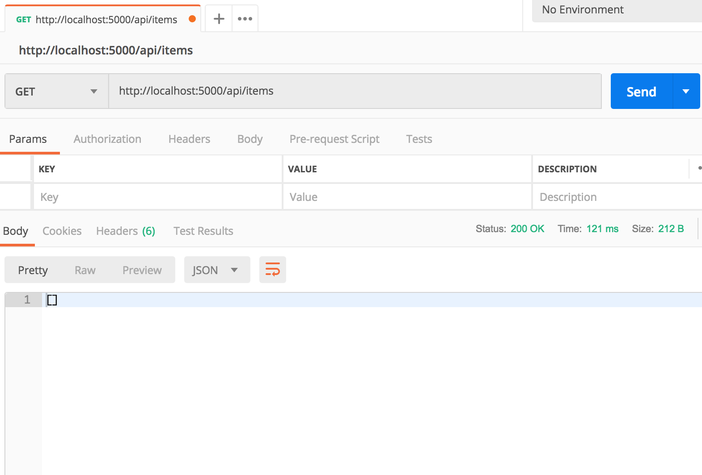
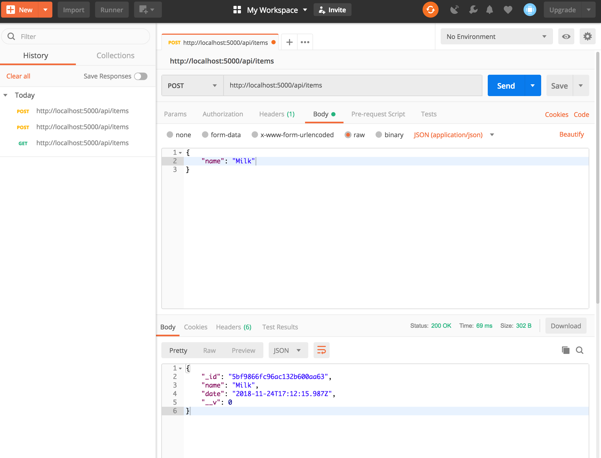
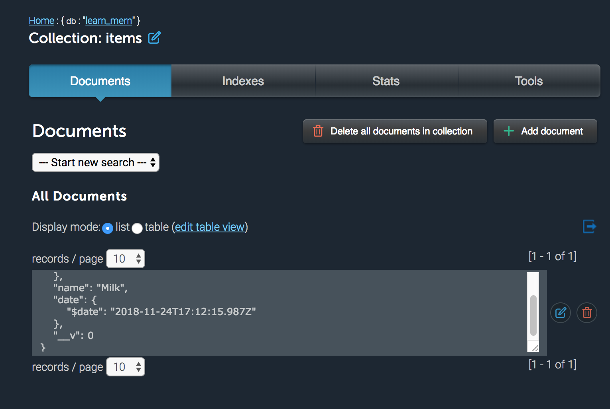
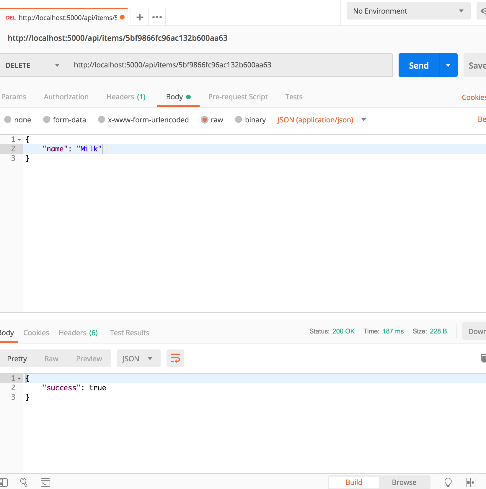
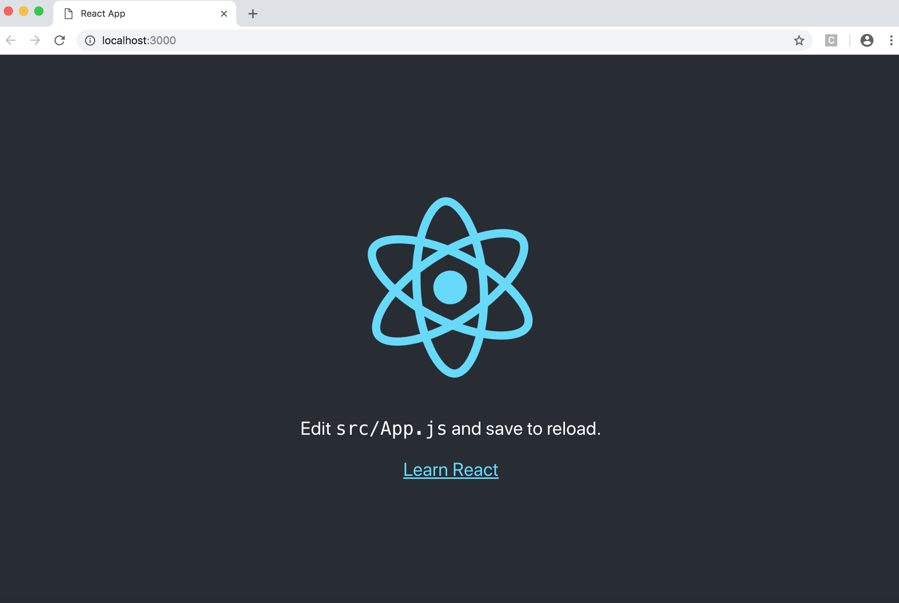
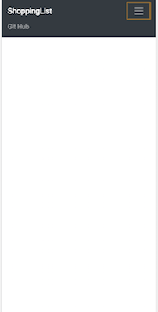
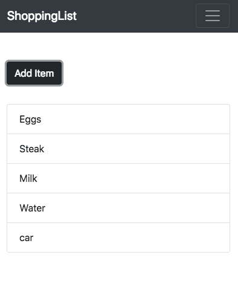
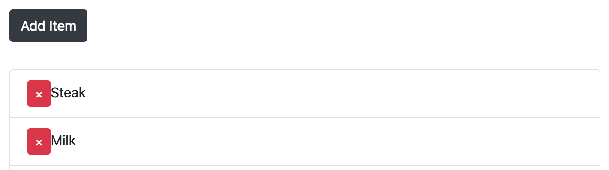
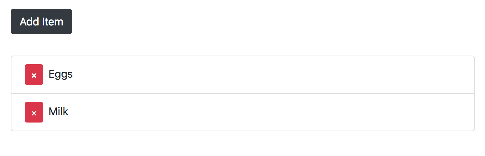
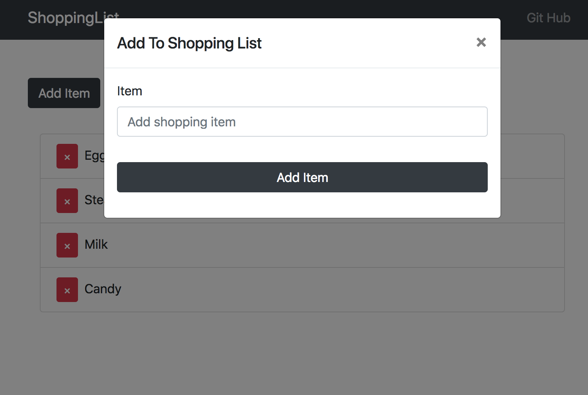

# Learning the MERN stack
I will follow a tutorial by Travesty Media that teaches how to learn the MERN stack.

## Contents
  * [What does the MERN stack consist of?](#what-does-the-mern-stack-consist-of-)
  * [Getting started](#getting-started)
  * [Server.js file](#serverjs-file)
  * [Now to set up the API](#now-to-set-up-the-api)
  * [Setting up Frontend (React)](#setting-up-frontend--react-)
  * [React](#react)
      - [Creating Shopping List component](#creating-shopping-list-component)
    + [Implementing Redux](#implementing-redux)
    + [Connecting the Backend](#connecting-the-backend)
    + [Time to deploy the app in heroku](#time-to-deploy-the-app-in-heroku)


## What does the MERN stack consist of?

- MongoDB: No SQL Data base

- Express: Backend framework (mostly used for building API's)

- React: Frontend UI library/ framework

- Node JS: JS runtime (allows to use javascript as a server side technology).

## Getting started
```npm init ``` - this Creates a package JSON file.

```npm i express body-parser mongoose concurrently ```

- express to create routes

- body-parser to handle data as it comes in

- mongoose interact with library

- concurrently to run more than 1 npm script at a time. This will enable us to run the server and the client at the same time.

``` npm i -D nodemon```
nodemon allows me to save changes in the server and not need to reboot in order to see these changes, the -D saves it as a dev dependency

Add the following scripts to the package JSON to enable nodemon to work:

``` JSON


"start": "node server.js"
"server": "nodemon server.js"


```
to run nodemon (we will use this later when this is set up) ``` npm run server ```

Now to create the server.js file and connect to the database.

## Server.js file

``` Javascript
// server.js
const express = require('express');
const mongoose = require('mongoose');
const bodyParser = require('body-parser');
// requires dependencies
const app = express();
// connect to express

app.use(bodyParser.json());
//Body Parser middleware

```
Now got to mlab, set up a database and copy the URI.

I saved my URI to a folder on the root called config and in a file called keys.js. (config/keys.js). I set a this to

I exported this as an object with mongoURI as the key.

``` Javascript
// config/keys.js
module.exports = {
  mongoURI: 'mongodb://<dbuser>:<dbpassword>@ds09876ect...'
}
```
I then refer back to this from my server.js
``` Javascript
// server.js
// DB config. this is getting hidden variable from my config file
const db = require('./config/keys').mongoURI;

```
Now I need to connect to Mongo DB using mongoose and pass in the db object
``` Javascript
// server.js
// Connect to mongoDB
mongoose
  .connect(db)
  //after connection attempt return the following
  .then(() => console.log('MongoDB Connected...'))
  //if it errors then return the error
  .catch(err => console.log(err));

// now to run server we want to connect to a port. The process.env.PORT allow me to connect to an external server. I have it to go to port 5000 if not.
const port = process.env.PORT || 5000;

app.listen(port, () => console.log('Server started on port '+ port));
// this will listen on this port and callback when it starts on that port

```
Now I should be able to use ```npm run server ``` in the command line and start the sever.

## Now to set up the API
This is to get request from the front end to fetch items, post items and delete them from the database.

I need to create a model.

- Create a folder called models and a file called Items.js at the root (models/Items.js). In this file we need to set up a Schema:

``` Javascript
// models/Items.js
const mongoose = require('mongoose');
const Schema = mongoose.Schema;

// Create Schema
const ItemSchema = new Schema({
  name: {
    type: String,
    require: true
  },
  date: {
    type: Date,
    default: Date.now
  }
});

module.exports = Item = mongoose.model('item', ItemSchema);
// this allows access to the file
```
- Create a folder called routes and a subfolder called api at the root. In the api folder create a file called items.js (routes/api/items.js). Then require this from the sever file. This keeps the code clean and separates the api that will just return json.

``` Javascript
// server.js

const items = require('./routes/api/items')

```

- We also want any request that goes to api/ items to use this file. So we need to add this to the server.js code as well above the definition of the port.

```Javascript
// server.js

// Use routes
app.use('/api/items', items);

```

- This will make it refer to the items variable. Now we need to set up the items api:


``` Javascript
// ./routes/api/items
const express = require('express');
const router = express.Router();

// Item Model
const Item = require('../../models/Items')

// At the bottom to make this accessible
module.exports = router;
```
- Now we can create some routes

``` Javascript

// @route GET api/items
// @desc Get All items
// @access Public
router.get('/', (req, res) => {
  Item.find()
    .sort({ date: -1})
    .then(items => res.json(items));
});
```
- To test this API used Post man. This shows a 200 response and an empty array. This means the route is working.


- Now to set up our post end point. Copy the code we right earlier for our get request and change it to a post request

``` Javascript
// routes/api/items.js

// @route POST api/items
// @desc Create a item
// @access Public
router.post('/', (req, res) => {
  const newItem = new Item({
    name: req.body.name
  });
  newItem.save().then(item => res.json(item));
  // This saves to the database and returns it in json
});

```

- We can test this in Post man by entering a post to the database. 

- If you then check in the database its is now save in MongoDB. .

- Next we need to be able to delete an item. We can copy the code we made for both post and get then change it delete request (we will need to specify an id).

``` Javascript
// routes/api/items.js

// @route DELETE api/items/:id
// @desc Delete an item
// @access Public
router.delete('/:id', (req, res) => {
  // /:id is a placeholder for what we pass in as an id
  Item.findById(req.params.id)
  // req.params.id gets id from the params we pass
    .then(item => item.remove().then(() => res.json({ success: true})))
    .catch(err => res.status(404).json({ success: false}));
});

```

- I can test this with a delete request in postman .

Now the Backend API is complete.

## Setting up Frontend (React)
- Create a folder called client

- ``` cd client ```

- If you dont have react app installed globally then...

- ``` npm i -g create-react-app ``` or if installed already then just use ```create-react-app .```

- This creates a package.json in the client folder which is separate to the server package.json.

- you need to add a proxy value in the client package.json. This will make it understand axios.get('http://localhost:5000/api/items') with just axios.get('api/items').

- To do this under scripts in the client package.json put

``` JSON
"scripts":{
/* scripts */
  },
"proxy": "http://localhost:5000",
```

- We want to run both back and front end at the same time and to do this we use concurrently. (this is why we installed this earlier)

- Add client script to the server package.json scripts

``` JSON
"client": "npm start --prefix client"
```

- the -- prefix client makes it go into the client folder and run npm start.

- We now want a script that runs both the server an the client simultaneously. In the server package.json add...

```   JSON
"dev": "concurrently \"npm run server\" \"npm run client\""
```

- We can put a client install script. This means if someone clones the repo then they can use ``` npm run client install
``` and not need to go into the client folder to install dependencies.

``` JSON
"client-install": "npm install --prefix client",

```

- Now our scripts are set up if we use ```npm run dev``` then not only will the back end start but also the front end will load up and the react server will open. like so...



Now we start working on our react app.
## React

- In client folder we can start cleaning up the out of the box material.
 - Delete logo.svg in src folder.
 - Delete index.css in src folder.
 - Keep App.css but remove content from inside.
 - In index.js file remove import for index.css
 - Remove import logo.svg from App.js file.
 - Only leave the parent div in the render of the App.js file. then put Hello world in a h1 between this div.

- We need to ad dependencies to the react application.

- open a new terminal and ``` cd client ```

- ``` npm i bootstrap reactstrap uuid react-transition-group
```
 - Bootstrap: allows to use bootstrap css
 - Reactstrap: Allows to use bootstrap components as react components.
 - UUID: Generates random id's
 - React-transition-group

#### Creating Nav Bar component
- import bootstrap in App.js file

``` Javascript
// client/src/App.js
import 'bootstrap/dist/css/bootstrap.min.css';

```

- You can now see that the font has changes in the h1 as it has css.

- in scr folder we need to create a folder call components and in that folder we will have a file called AppNavbar.js

- We will be using React strap and the [documentation](https://reactstrap.github.io/components/alerts/) has examples of loads of things to use.

- To start we will need to create a React component

``` Javascript
import React, { Component } from 'react';
// All components that you want to import from https://reactstrap.github.io/components/alerts/
import {
  Collapse,
  Navbar,
  NavbarToggler,
  NavbarBrand,
  Nav,
  NavItem,
  NavLink,
  Container
} from 'reactstrap';

class AppNavbar extends Component {
  state = {
      isOpen: false
  }
  // state is closed
  toggle = () => {
    this.setState({
      isOpen: !this.state.isOpen
    });
  // Toggle will change state to open
  }

  render() {
    return (
      <div>
        <Navbar color="dark" dark expand="sm" className="mb-5">
          <Container>
            <NavbarBrand href="/">ShoppingList</NavbarBrand>
            <NavbarToggler   onClick={this.toggle} />
            <Collapse isOpen={this.state.isOpen} navbar>
              <Nav className="ml-auto" navbar>
                <NavItem>
                  <NavLink href="https://github.com/bmoishe">
                    Git Hub
                  </NavLink>
                </NavItem>
              </Nav>
            </Collapse>
          </Container>
        </Navbar>
      </div>
    );
  }
}


export default AppNavbar;
```
- Now we need to include this in our App.js file.

``` Javascript
// client/src/App.js
import AppNavbar from './component/AppNavbar'
```

Also you will need to replace hello world in App.js with AppNavbar
``` Javascript
// client/src/App.js
<div className="App">
  <AppNavbar/>
</div>
```
Woila:


#### Creating Shopping List component

- Create new file called ShoppingList.js in components folder (client/src/components/ShoppingList.js)

-
``` Javascript
// client/src/components/shoppingList.js
import React, { Component } from 'react';
import { Container, ListGroup, ListGroupItem, Button } from 'reactstrap';
import { CSSTransition, TransitionGroup } from 'react-transition-group';
import uuid from 'uuid';

class ShoppingList extends Component {
  state = {
    items: [
      { id: uuid(), name: 'Eggs' },
      { id: uuid(), name: 'Steak' },
      { id: uuid(), name: 'Milk' },
      { id: uuid(), name: 'Water' }
    ]
  }

  render() {
    const { items } = this.state;
    return(
      <Container>
        <Button
          color="dark"
          style={{marginBottom: '2rem'}}
          onClick={() => {
            const name = prompt('Enter Item');
            if(name) {
              this.setState(state => ({
                items: [...state.items, { id: uuid(), name }]
              }));
            }
          }}
          >Add Item</Button>
      </Container>
    );
  }
}
export default ShoppingList;
```
- import this in App.js

``` Javascript
/// client/src/App.js
import ShoppingList from './components/ShoppingList'
```
- Add this under AppNavbar

``` Javascript
/// client/src/App.js
<div className="App">
  <AppNavbar/>
  <ShoppingList/>
</div>
```
- We are now able to add items on the front end (You can see this with the react dev tool)

- No we need to display those items.

``` Javascript
// client/src/components/shoppingList.js
>Add Item</Button>
//  Add between here
<ListGroup>
  // map through each item and wrap in TransitionGroup
  <TransitionGroup className="shopping-list">
    {items.map(({id, name }) => (
      <CSSTransition key={id} timeout={500} classNames="fade">
        <ListGroupItem>{name}</ListGroupItem>
      </CSSTransition>
    ))}
  </TransitionGroup>
</ListGroup>

//  and here
</Container>
```
- Now you can see items added in the frontend.


- We can now add a delete button between the ListGroupItem tags

``` Javascript
// client/src/components/shoppingList.js

<ListGroupItem>
// between here
<Button
  className="remove-btn"
  color="danger"
  size="sm"
  onClick={() => {
    this.setState(state => ({
      items: state.items.filter(item => item.id !== id)
    }));
  }}
>
 &times;
</Button>


// and here
{name}
</ListGroupItem>
```
- We have now can delete items on the front end. 

- Now we can update our CSS to make a fade effect when deleted.

``` CSS
/* client/src/App.css  */
.remove-btn {
  margin-right: 0.5rem;
  /* This is to align our buttons  */
}
/* When we add an item */
.fade-enter {
  opacity: 0.01;
}

.fade-enter-active {
  opacity: 1;
  transition: opacity 1000ms ease-in;
    /* we are transitioning the opacity from hardly visible in fade-enter (0.01) to visible (1) in fade-enter-active */
}
/* When we delete an item */
.fade-exit {
  opacity: 1;
}

.fade-exit-active {
  opacity: 0.01;
  transition: opacity 1000ms
  /* We do the reverse on exit */
}
```



### Implementing Redux

- Make sure you are in the client folder
 - ``` npm i  redux react-redux redux-thunk```
 - redux: A state manager where we keep out data in the front end
 - react-redux: binds react to redux
 - redux-thunk: Way to make async calls to server

- in client/src folder create a file called store.js. [Redux](https://redux.js.org/api/store) says
"A store holds the whole state tree of your application. The only way to change the state inside it is to dispatch an action on it."

``` Javascript
// client/src/store.js
import { createStore applyMiddleware, compose } from 'redux';
import thunk from 'redux-thunk';
import rootReducer from './reducers';

const initialState = {};

const middleware = [thunk];

const store = createStore(rootReducer, initialState, compose(
  applyMiddleware(...middleware),
  window.__REDUX_DEVTOOLS_EXTENSION__ && window.__REDUX_DEVTOOLS_EXTENSION__()
));

export default store;

```

- In App.js we need to bring in a provider

``` Javascript
// client/src/App.js
import { Provider } from 'react-redux';
import store from './store';
```
- In order to use redux we need to wrap everything in our return with the provider
``` Javascript
// client/src/App.js
return (
  // from here too...
  <Provider store={store}>
    <div className="App">
      <AppNavbar />
      <ShoppingList />
    </div>
  </Provider>
  // here
);
```
- Now we can access stuff from our state to our components

- Now create a folder called reducers in the src folder and in that a file called index.js this is to bring together all reducers. src/reducers/index.js

``` Javascript
import { combineReducers } from 'redux';
import itemReducer from './itemReducer'

export default combineReducers({
  item: itemReducer
});

 ```
 - Now to create a item reducer (client/src/reducer/itemReducer.js). This is where our state is going to go and where we check out actions.

 ``` Javascript
// client/src/reducer/itemReducer.js
import uuid from 'uuid';
// Ultimately we will be removing this once we get out data from the database.
const initialState = {
  items: [
    { id: uuid(), name: 'Eggs' },
    { id: uuid(), name: 'Steak' },
    { id: uuid(), name: 'Milk' },
    { id: uuid(), name: 'Water' }
  ]
}
 ```
- Create a folder called actions in src folder and a file called types.js (client/src/actions/types.js)( these will be a set of conststands set to strings that we export)

``` Javascript
// client/src/actions/types.js
export const GET_ITEMS = 'GET_ITEMS';
export const ADD_ITEM = 'ADD_ITEM';
export const DELETE_ITEM = 'DELETE_ITEM';
// Add an action type fro anything you will do in the applications
```
- No bring these in to the reducers
``` Javascript
// client/src/reducer/itemReducer.js
import { GET_ITEMS, ADD_ITEM, DELETE_ITEM } from '../actions/types';
```
- We need to add a switch statement in the reducer.

``` Javascript
// client/src/reducer/itemReducer.js
export default function(state = initialState, action) {
  switch(action.type){
    case GET_ITEMS:
      return {
        ...state
      }
    default:
      return state;
  }
}
```
- Now we need an action to use: create a file called itemsActions.js

``` Javascript
// client/src/itemsActions.js
import { GET_ITEMS, ADD_ITEM, DELETE_ITEM } from './types';

export const getItems = () => {
  return {
    type: GET_ITEMS
  };
};
```

- Now to call this from the the Component rather than the state in the ShoppingList

``` Javascript
// client/components/ShoppingList
import { connect } from 'react-redux';
import { getItems } from '../actions/itemsActions';
import PropTypes from 'prop-types'
// remove state from shopping list class and replace with


// state = {
//   items: [
//     { id: uuid(), name: 'Eggs' },
//     { id: uuid(), name: 'Steak' },
//     { id: uuid(), name: 'Milk' },
//     { id: uuid(), name: 'Water' }
//   ]
// }
// and replace with
 componentDidMount() {
   this.props.getItems();
 }
 render() {
   // add this in this.props.item instead of this.state
   const { items } = this.props.item;
   return(

// at the bottom of the page update export default ShoppingList; instead of exporting the class we export connect and the component wrapped in it

ShoppingList.propTypes = {
  getItems: PropTypes.func.isRequired,
  item: PropTypes.object.isRequired
}
const mapStateToProps = (state) => ({
  item: state.item
});

export default connect(mapStateToProps, { getItems }) (ShoppingList);

```

- We now need to update the delete items to use the reducer and create a new feature for adding a item.

First we need to remove the button for adding item as we will not use this and more

``` Javascript
// client/components/ShoppingList
// remove all this
<Button
  color="dark"
  style={{marginBottom: '2rem'}}
  onClick={() => {
    const name = prompt('Enter Item');
    if(name) {
      this.setState(state => ({
        items: [...state.items, { id: uuid(), name }]
      }));
    }
  }}
  >Add Item</Button>

```
- Add deleteItem:
``` Javascript
// client/components/ShoppingList
// remove import uuid from 'uuid'; as we no longer need this.
// add deleteItem to the imports from itemsActions file
import { getItems, deleteItem } from '../actions/itemsActions';
// ensure deleteItem is in the export at the bottom.
export default connect(mapStateToProps, { getItems, deleteItem })(ShoppingList);
```
- Now in itemsActions file we need to create the delete function

``` Javascript
// client/src/Actions/itemsActions.js
// Copy the previously use getItems and change to the following
export const deleteItem = (id) => {
  return {
    type: DELETE_ITEM,
    payload: id
  };
};

```
- Add a case for delete in reducer.
``` Javascript
// client/src/reducers/itemReducer.js
export default function(state = initialState, action) {
  switch(action.type){
    case GET_ITEMS:
      return {
        ...state
      }
    case DELETE_ITEM:
      return {
        ...state,
        items: state.items.filter(item => item.id !== action.payload)
      };
    default:
      return state;
  }

```
- Now we need to update the component by setting up a function access the delete. (Remove the existing code for the onClick) e.g.
``` Javascript  
// client/components/ShoppingList
onClick={
// remove this
  () => {
  this.setState(state => ({
    items: state.items.filter(item => item.id !== id)
  }));
}}
```
- Replace with

``` Javascript
// client/components/ShoppingList
onClick={this.onDeleteClick.bind(this, id)}
```
- Should create this method
```Javascript
// client/components/ShoppingList
onDeleteClick = (id) => {
  this.props.deleteItem(id)
}
```
- Now to create the modal (add) component. Let create a file in component called ItemModal.js (client/src/components/ItemModal.js).

``` Javascript
// client/src/components/ItemModal.js
import React, { Component } from 'react';
import {
  Button,
  Modal,
  ModalHeader,
  ModalBody,
  Form,
  FormGroup,
  Label,
  Input
} from 'reactstrap';
import { connect } from 'react-redux';
import { addItem } from '../actions/itemActions';

class ItemModal extends Component {
  state = {
    modal: false,
    name: ''
  }

  toggle = () => {
    this.setState({
      modal: !this.state.modal
    });
  }

  onChange = (e) => {
    this.setState({[e.target.name]: e.target.value });
  }
  render() {
    return(
      <div>
        <Button
          color="dark"
          style={{marginBottom: '2rem'}}
          onClick={this.toggle}
        >Add Item</Button>
        <Modal
          isOpen={this.state.modal}
          toggle={this.toggle}
        >
          <ModalHeader toggle={this.toggle}>
          Add To Shopping List
          </ModalHeader>
            <ModalBody>
              <Form onSubmit={this.onSubmit}>
                <FormGroup>
                  <Label for="item">Item</Label>
                    <Input
                      type="text"
                      name="name"
                      id="item"
                      placeholder="Add shopping item"
                      onChange={this.onChange}
                    />
                    <Button
                      color="dark"
                      style={{marginTop: '2rem'}}
                      block
                    >Add Item</Button>

                </FormGroup>

              </Form>

            </ModalBody>
        </Modal>
      </div>
    )
  }
}

export default connect()(ItemModal);

```
Inside App.js import modal component and add to render
``` Javascript
// client/src/App.js
import ItemModal from './components/ItemModal';
import { Container } from 'reactstrap';

// insert between AppNavbar and shoppingList and wrap ItemModal and ShoppingList in a container
<Container>
  <ItemModal />
  <ShoppingList />
</Container>

```

- Now you have a modal but it does not submit once clicked



To make this submit we need to add onSubmit in the ItemModal.js file
``` Javascript
// client/src/components/ItemModal.js
import uuid from 'uuid';
// We are only using this until we link up the back end.

onChange = (e) => {
  this.setState({[e.target.name]: e.target.value });
}
// after here
onSubmit = e => {
  e.preventDefault();

  const  newItem = {
    id: uuid(),
    name: this.state.name
  }

  // Add item via addItem actions
  this.props.addItem(newItem);

  // Close ModalBody
  this.toggle();
}

// Before here
render() {

// we also need to update the export at the bottom of the page by creating mapStateToProps const and updating export.

const mapStateToProps = state => ({
  item: state.item
})
export default connect(mapStateToProps, { addItem })(ItemModal);

```

- We now need to create the add item action in itemsActions.js file.

``` Javascript
// client/src/actions/itemsActions.js
export const addItem = (item) => {
  return {
    type: ADD_ITEM,
    payload: item
  };
};

```

- Now in the reducer we need to add the case

``` Javascript
// client/src/reducer/itemsReducer.js
case DELETE_ITEM:
  return {
    ...state,
    items: state.items.filter(item => item.id !== action.payload)
  };
// After This
  case ADD_ITEM:
    return {
      ...state,
      items: [action.payload, ...state.items]
    }
// Before this
default:
  return state;

```
- This can add items in the UI. Now we need to make it add to the Backend.

### Connecting the Backend
- In the itemReducer.js file we need to remove the static content that we pull through. Keep the items array empty.

``` Javascript
// client/src/itemReducer
//  we need to add ITEMS_LOADING as an import from the action/types file
import { GET_ITEMS, ADD_ITEM, DELETE_ITEM, ITEMS_LOADING } from '../actions/types';
const initialState = {
  items: [
// Remove static items to have an empt array  { id: uuid(), name: 'Eggs' },
  // { id: uuid(), name: 'Steak' },
  // { id: uuid(), name: 'Milk' },
  // { id: uuid(), name: 'Candy' }
],
  // Add loading value to false and we will set to true when we receive the data
  loading: false
};
```

- Lets add ITEMS_LOADING to types

```Javascript
// client/src/actions/types.js
export const ITEMS_LOADING = 'ITEMS_LOADING';

```
- We need to add this as a case in itemReducer
```Javascript
// client/src/reducer/itemReducer.js
case ITEMS_LOADING:
  return {
    ...state,
    loading: true
  }
```
- We need to add in out itemsActions file setItemsLoading.
``` Javascript
// client/src/actions/itemActions.js
import { GET_ITEMS, ADD_ITEM, DELETE_ITEM, ITEMS_LOADING } from './types';
// at the bottom add...
export const setItemsLoading = () => {
  return {
    type: ITEMS_LOADING
  };
};
```
- Now we need to fetch the items

- Lets install axios on client folders
 - ```npm i axios ``` (this is a http client)
- import axios in itemActions.js file

``` Javascript
// client/src/actions/itemActions.js
import axios from 'axios';
// we need to add dispatch to get items to make it asynchronous
export const getItems = () => dispatch => {
  // Remove
  // return {
  //   type: GET_ITEMS
  // };
  dispatch(setItemsLoading());
  axios
   .get('/api/items')
   .then(res =>
     dispatch({
       type: GET_ITEMS,
       payload: res.data
     })
   )
};

```
- In reducer on get items we need to also get the items
``` Javascript
switch(action.type){
  case GET_ITEMS:
    return {
      ...state,
      items: action.payload,
      loading: false
      // This makes a copy of the current state and adding items from action.payload. We also return loading back to false
    }
```
- This is now using data from the database.
- Now lets use the add item

``` Javascript

  // replace
  // export const addItem = (item) => {
  //   return {
  //     type: ADD_ITEM,
  //     payload: item
  //   };
  // };
  // with
export const addItem = item => dispatch => {
  axios
    .post('api/items', item)
    .then(res =>
      dispatch({
        type: ADD_ITEM,
        payload: res.data
      })
    )
  };

```
- We need to remove uuid from itemModal
```Javascript
// components/itemModal.js
// Remove
// import uuid from 'uuid';
const  newItem = {
  // Remove
  // id: uuid(),
  name: this.state.name
}
```

- We need to remove uuid from reducer
``` Javascript
// itemReducer.js
// import uuid from 'uuid';
```
- Now we need to update delete

- We need to update id in shoppingList.js to _id as mongo uses _id not id.

``` Javascript
// ShoppingList.js
{items.map(({_id, name }) => (
  <CSSTransition key={_id} timeout={500} classNames="fade">
    <ListGroupItem>
    <Button
      className="remove-btn"
      color="danger"
      size="sm"
      onClick={this.onDeleteClick.bind(this, _id)}
```
- We need to sort out action for delete item like we did with get and add.

``` Javascript
// actions/itemsActions
export const deleteItem = id => dispatch => {
// Remove
  // return {
  //   type: DELETE_ITEM,
  //   payload: id
  // };
  axios.delete(`/api/items/${id}`).then(res => dispatch({
    type: DELETE_ITEM,
    payload: id
  })
)
};
```
- In the reducer

``` Javascript
// itemReducer.js
// Update id to be _id
case DELETE_ITEM:
  return {
    ...state,
    items: state.items.filter(item => item._id !== action.payload)
  };
```

- Finishing touch. Change title from react app to Shopping list.

``` HTML
// client/public/index.html
    // <title>React App</title>
        <title>Shopping List</title>
```
- We now have a full stack MERN application

Now lets deploy this online

### Time to deploy the app in heroku

In server.js
``` Javascript
// Require path
const path = require('path');
// Then between Use routes and port...
// Use routes
app.use('/api/items', items);
// under here
// Serve Static assets if we are in production
if(process.env.node_env === 'production') {
  // Set static folders
  app.use(express.static('client/build'));

  app.get('*', (req, res) => {
    res.sendFile(path.resolve(__dirname, 'client', 'build', 'index.html'));
  })
}

// above here
const port = process.env.PORT || 5000;
```
- Now to create the post build script. in the package.json in the servers scripts

``` JSON
"dev": "concurrently \"npm run server\" \"npm run client\"",
// under here
"heroku-postbuild": "NPM_CONFIG_PRODUCTION=false npm install --prefix client && npm run build --prefix client"
// above here
},
"author": "",
```
- This makes it go into client folder and install dependencies.

- now go to [Heroko CLI]('https://devcenter.heroku.com/articles/heroku-cli') and install and sign up.

- Ensure you are in server folder then login with
``` heroku login ```

- Now to create a new heroku app ``` heroku create ```

- On the [ Heroku's dashboard ]('https://dashboard.heroku.com/login') you will see the name of the url they have provided.

- Click on that and then deploy

- Ensure you have git installed and initialise the repository then add heroku repository which is provided on that screen. something like this(heroku git:remote -a moishe's-cool-87016) .

-- Now ```git push heroku master```
